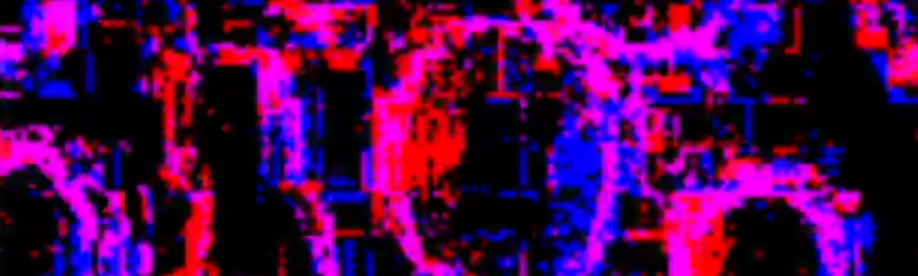
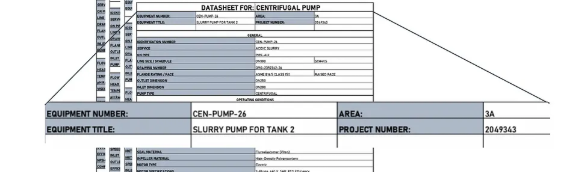

# Projects

## Neuromorphic Computing for Event Based Star Tracking

  

    
    
High frequency vibrations onboard small and nano satellites are an issue - especially in the case of space domain awareness missions. This novel end-to-end neuromorphic hardware and software allows for asynchoronous detection and control of these high frequency perburations. The asynchoronous hardware such as Loihi 2 chip allows for power savings in the order of magnitudes onboard satellites.

    <ul>
      <li>Developed with the Australian Institute of Machine Learning</li>
      <li>Sentient Satellites Lab</li>
      <li>Conference paper: <a href="http://example.com">25th AMOS Conference Papers</a></li>
      <li>Developed using LAVA in a part of Intel's Neuromorphic Research Community</li>
    </ul>
  

## Navigating Unstructured Data for Industrial Engineers

  

    
    
Engineers are swamped with data to manage when carrying out their duties. Technical reports, mechanical datasheets, company regulations, national and international standards. Using NLP, embeddings, and large language models, the search space for the relevant data regarding the engineers' current task can be significantly narrowed, allowing for smart search of documents, drawings, tables and scanned handwritten notes from operators. Paired with a chatbot, this can provide the basis for a retrieval augmented generation powered agent to help engineers perform tasks such as writing an inspection report.

    <ul>
      <li>Developed as internship @ the Massachusets Institute of Technology Media Lab</li>
      <li>Human Dynamics lab via MIT bigdata living lab</li>
    </ul>
  

